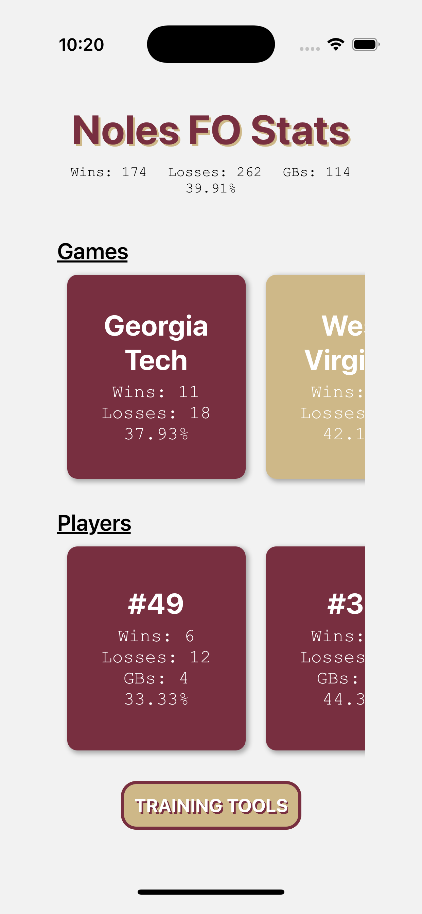
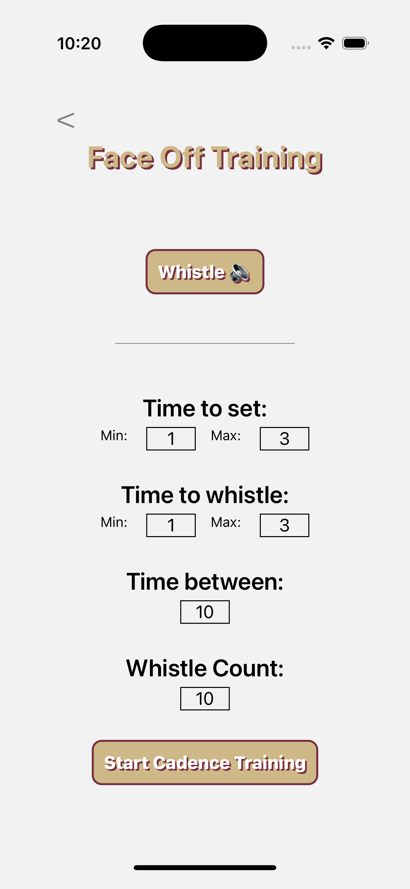
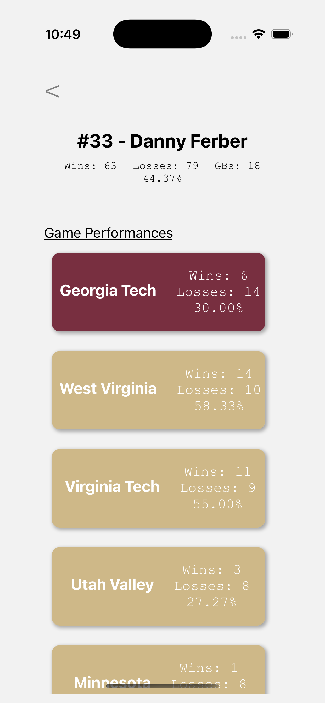
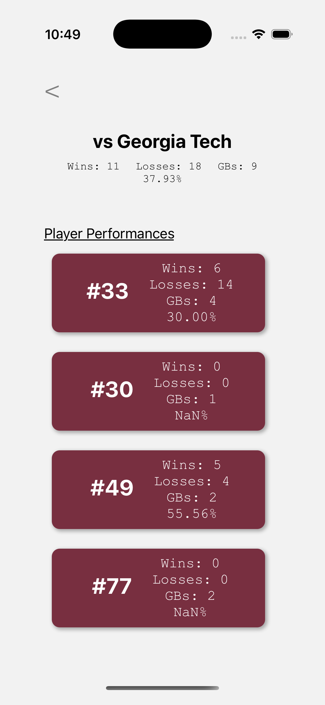

# Welcome to Noles FO 🥍

Follow along with the Florida State Men's club lacrosse face-off athletes and improve skills with the included training tools. View the individual game by game performances of each face-off athlete on the FSU lacrosse team throughout the season. Use the built in whistle and random cadence tool to improve your whistle discipline!

<div style="display: flex; gap: 20px; justify-content: center;">
   
   
   
   

</div>

### Download Now!

[Nole FO](https://apps.apple.com/us/app/bottle-caps/id6744372300) is available for download in the IOS app store now!

## Framework and Dependencies

- **Package Manager**: [NPM](https://www.npmjs.com/)
- **Build Platform**: [Expo](https://expo.dev)
- **Framework**: [React Native](https://reactnative.dev/)
- **Statistics API**: [FO Stats](https://fo-stats.willc-dev.net/)

## Get started

1. <strong>Clone Repository</strong>

   ```bash
   git clone https://github.com/wcouture/NolesFOStats.git
   ```

2. <strong>Install dependencies</strong>

   ```bash
   npm install
   ```

   <i>Execute the previous command within the root directory of the cloned repository.</i>

3. <strong>Start the app</strong>

   ```bash
    npx expo start
   ```

In the output, you'll find options to open the app in a

- [development build](https://docs.expo.dev/develop/development-builds/introduction/)
- [Android emulator](https://docs.expo.dev/workflow/android-studio-emulator/)
- [iOS simulator](https://docs.expo.dev/workflow/ios-simulator/)
- [Expo Go](https://expo.dev/go), a limited sandbox for trying out app development with Expo

Source files are located within the **app** directory. This project uses [file-based routing](https://docs.expo.dev/router/introduction).
